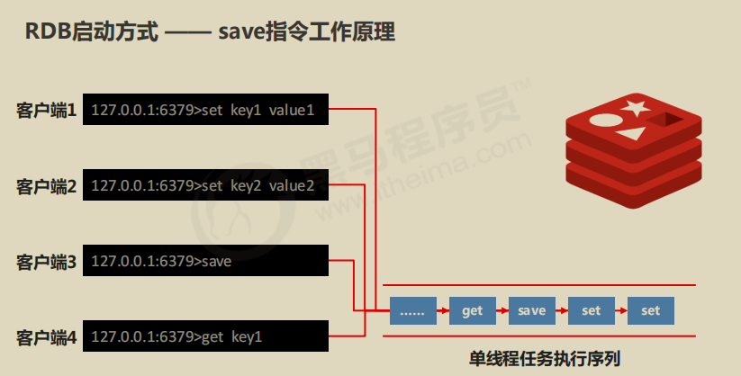
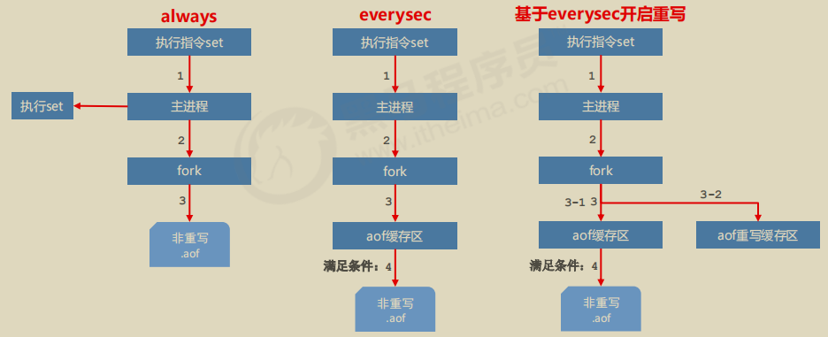

# 一. Redis持久化

**什么是持久化**

​	利用永久性存储介质将数据进行保存，在特定的时间将保存的数据进行恢复的工作机制称为持久化。

**为什么要进行持久化**

​	防止数据的意外丢失，确保数据安全性


# 二. RDB (Redis DataBase)

在指定的事件间隔内,将内存中的数据集快照写入磁盘,会生成一个rdb文件     比AOF高效,但最后一次持久化可能丢失数据

恢复只要把rdb文件放在redis启动目录下,redis启动时会自动检查dump.rdb,恢复其中的数据


## 1. **RDB启动方式1 —— save指令**

- 命令

  ```
  save
  ```

- 作用

  手动执行一次保存操作


**save指令相关配置**

-  dbfilename dump.rdb

  ​	说明：设置本地数据库文件名，默认值为 dump.rdb

  ​	经验：通常设置为 dump-端口号.rdb

-  dir

  ​	说明：设置存储.rdb文件的路径

  ​	经验：通常设置成存储空间较大的目录中，目录名称**data**

-  rdbcompression yes

  ​	说明：设置存储至本地数据库时是否压缩数据，默认为 yes，采用 LZF 压缩

  ​	经验：通常默认为开启状态，如果设置为no，可以节省 CPU 运行时间，但会使存储的文件变大（巨大）

- rdbchecksum yes

  ​	说明：设置是否进行RDB文件格式校验，该校验过程在写文件和读文件过程均进行

  ​	经验：通常默认为开启状态，如果设置为no，可以节约读写性过程约10%时间消耗，但是存储一定的数据损坏风险





**注意：**save指令的执行会阻塞当前Redis服务器，直到当前RDB过程完成为止，有可能会造成长时间阻塞，线上环境不建议使用。


**数据量过大，单线程执行方式造成效率过低如何处理？**

## **2. RDB启动方式2 —— bgsave指令**

-  命令

  ```
  bgsave
  ```

- 作用

  手动启动后台保存操作，但不是立即执行


**bgsave指令相关配置**

-  dbfilename dump.rdb

-  dir

- rdbcompression yes

- rdbchecksum yes

- stop-writes-on-bgsave-error yes

  ​	说明：后台存储过程中如果出现错误现象，是否停止保存操作

  ​	经验：通常默认为开启状态


**注意：** bgsave命令是针对save阻塞问题做的优化。Redis内部所有涉及到RDB操作都采用bgsave的方式，save命令可以放弃使用**。**


**反复执行保存指令，忘记了怎么办？不知道数据产生了多少变化，何时保存？**

## 3. **RDB启动方式3 —— save配置**

- 配置

  ```
  save second changes
  ```

- 作用

  ​	满足限定时间范围内key的变化数量达到指定数量即进行持久化

- 参数

  ​	second：监控时间范围

  ​	changes：监控key的变化量

- 位置

  ​	在conf文件中进行配置

- 范例

  ```
  save 900 1
  save 300 10
  save 60 10000
  ```

  

**save配置相关配置**

- dbfilename dump.rdb

- dir

- rdbcompression yes

- rdbchecksum yes


**注意：** 

​	save配置要根据实际业务情况进行设置，频度过高或过低都会出现性能问题，结果可能是灾难性的

​	save配置中对于second与changes设置通常具有互补对应关系，尽量不要设置成包含性关系

​	save配置启动后执行的是bgsave操作


## 4. **RDB三种启动方式对比**

|      方式      | save指令 | bgsave指令 |
| :------------: | :------: | :--------: |
|      读写      |   同步   |    异步    |
| 阻塞客户端指令 |    是    |     否     |
|  额外内存消耗  |    否    |     是     |
|   启动新进程   |    否    |     是     |


## 5. **RDB优点**

1. RDB是一个紧凑压缩的二进制文件，存储效率较高

2. RDB内部存储的是redis在某个时间点的数据快照，非常适合用于数据备份，全量复制等场景

3. RDB恢复数据的速度要比AOF快很多

4. 应用：服务器中每X小时执行bgsave备份，并将RDB文件拷贝到远程机器中，用于灾难恢复。


## **6. RDB缺点**

1. RDB方式无论是执行指令还是利用配置，无法做到实时持久化，具有较大的可能性丢失数据

2. bgsave指令每次运行要执行fork操作创建子进程，要牺牲掉一些性能

3. Redis的众多版本中未进行RDB文件格式的版本统一，有可能出现各版本服务之间数据格式无法兼容现象


# 二. AOF (Append Only File)

**AOF概念**

- AOF(append only file)持久化：以独立日志的方式记录每次写命令，重启时再重新执行AOF文件中命令

  达到恢复数据的目的。与RDB相比可以简单描述为改记录数据为记录数据产生的过程

- AOF的主要作用是解决了数据持久化的实时性，目前已经是Redis持久化的主流方式


## **1. 写数据三种策略(appendfsync)**

- always(每次）

  每次写入操作均同步到AOF文件中，**数据零误差**，**性能较低**，不建议使用。 

-  everysec（每秒）

  每秒将缓冲区中的指令同步到AOF文件中，数据准确性较高，**性能较高**，建议使用，也是默认配置

  在系统突然宕机的情况下丢失1秒内的数据

-  no（系统控制）

  由操作系统控制每次同步到AOF文件的周期，整体过程**不可控**


**AOF功能开启**

-  配置

  **appendonly**  yes|no

  是否开启AOF持久化功能，默认为不开启状态

- 配置

  **appendfsync**  always|everysec***|***no

  AOF写数据策略


## 2. **AOF重写**

随着命令不断写入AOF，文件会越来越大，为了解决这个问题，Redis引入了AOF重写机制压缩文件体积。AOF文件重

写是将Redis进程内的数据转化为写命令同步到新AOF文件的过程。简单说就是将对同一个数据的若干个条命令执行结

果转化成最终结果数据对应的指令进行记录。


**AOF重写作用**

- 降低磁盘占用量，提高磁盘利用率

- 提高持久化效率，降低持久化写时间，提高IO性能

- 降低数据恢复用时，提高数据恢复效率


**AOF重写规则**

- 进程内已超时的数据不再写入文件

- 忽略无效指令，重写时使用进程内数据直接生成，这样新的AOF文件只保留最终数据的写入命令

  如del key1、 hdel key2、srem key3、set key4 111、set key4 222等 

- 对同一数据的多条写命令合并为一条命令

  如lpush list1 a、lpush list1 b、 lpush list1 c 可以转化为：lpush list1 a b c。

  为防止数据量过大造成客户端缓冲区溢出，对list、set、hash、zset等类型，每条指令最多写入64个元素


**AOF重写方式**

- 手动重写

  ```
  bgrewriteaof
  ```

- 自动重写

  ```
  auto-aof-rewrite-min-size size //最小大小
  
  auto-aof-rewrite-percentage percentag //百分比
  ```


**AOF自动重写方式**

- 自动重写触发条件设置

  **auto-aof-rewrite-min-size** *size*

  **auto-aof-rewrite-percentage** *percent*

- 自动重写触发比对参数（ 运行指令info Persistence获取具体信息 ） 

  **aof_current_size**

  **aof_base_size**

- 自动重写触发条件

  aof_current_size > auto-aof-rewrite-min-size

  (aof_current_size - aof_base_size) / aof_base_size >=  **auto-aof-rewrite-percentage


**AOF重写流程**




# 三. **RDB与AOF区别**


|  持久化方式  |    RDB     |     AOF      |
| :----------: | :--------: | :----------: |
| 占用存储空间 |     小     |      大      |
|   存储速度   |     慢     |      快      |
|   恢复速度   |     快     |      慢      |
|  数据安全性  | 会丢失数据 | 依据策略决定 |
|   资源消耗   | 高/重量级  |  低/轻量级   |
|  启动优先级  |     低     |      高      |


**RDB与AOF的选择之惑**

1. 对数据非常敏感，建议使用默认的AOF持久化方案

   - AOF持久化策略使用everysecond，每秒钟fsync一次。该策略redis仍可以保持很好的处理性能，当出

     现问题时，最多丢失0-1秒内的数据。

   - 注意：由于AOF文件存储体积较大，且恢复速度较慢

2. 数据呈现阶段有效性，建议使用RDB持久化方案

   - 数据可以良好的做到阶段内无丢失（该阶段是开发者或运维人员手工维护的），且恢复速度较快，阶段

     点数据恢复通常采用RDB方案

   - 注意：利用RDB实现紧凑的数据持久化会使Redis降的很低，慎重总结：

3. 综合比对
   - RDB与AOF的选择实际上是在做一种权衡，每种都有利有弊
   - 如不能承受数分钟以内的数据丢失，对业务数据非常敏感，选用AOF
   - 灾难恢复选用RDB
   - 双保险策略，同时开启 RDB 和 AOF，重启后，Redis优先使用 AOF 来恢复数据，降低丢失数据的量


