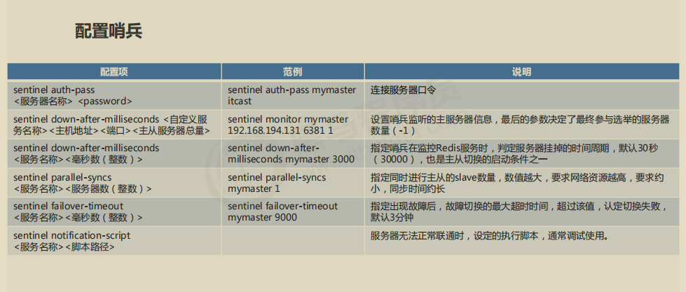
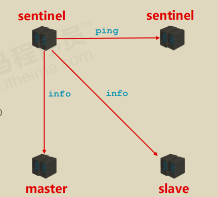
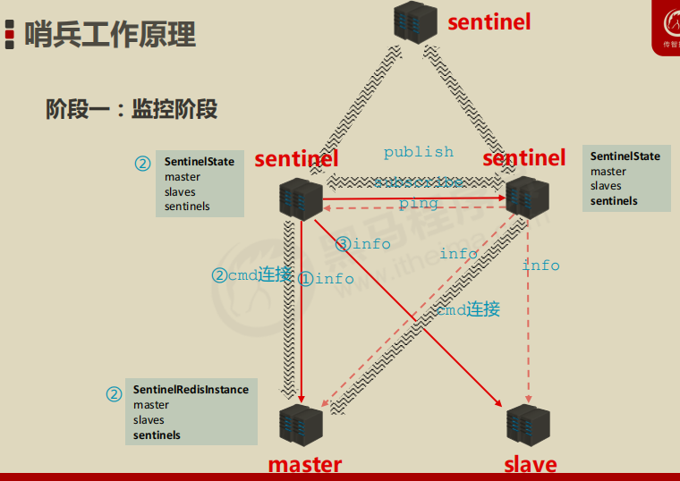
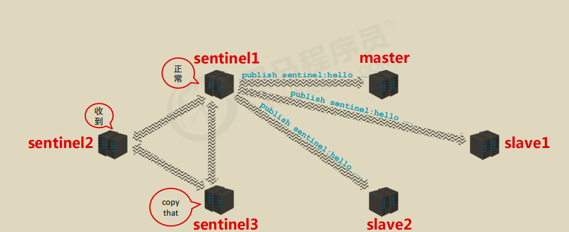
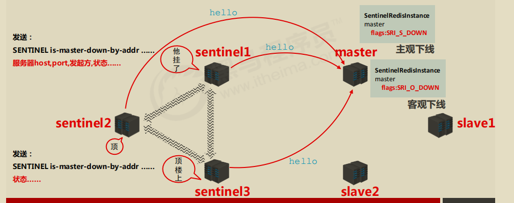
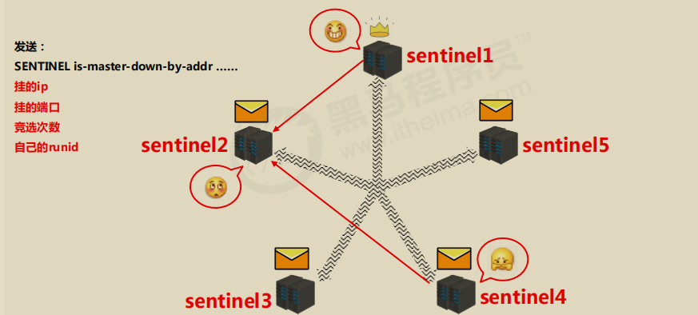

# 一. 哨兵简介

哨兵(sentinel) 是一个分布式系统，用于对主从结构中的每台服务器进行监控，当出现故障时通过投票机制选择新的

master并将所有slave连接到新的master。

**哨兵的作用**

- 监控

  不断的检查master和slave是否正常运行。

  master存活检测、master与slave运行情况检测

- 通知（提醒）

  当被监控的服务器出现问题时，向其他（哨兵间，客户端）发送通知。

- 自动故障转移

  断开master与slave连接，选取一个slave作为master，将其他slave连接到新的master，并告知客户端新的服

  务器地址

注意：

​	哨兵也是一台redis服务器，只是不提供数据服务

​	通常哨兵配置数量为单数

# 二. 启用哨兵模式

- 配置一拖二的主从结构

- 配置三个哨兵（配置相同，端口不同）

  参看sentinel.conf

- 启动哨兵

  **redis-sentinel** *sentinel-**端口号**.conf*

# 三. **哨兵工作原理**

**主从切换**

哨兵在进行主从切换过程中经历三个阶段

1. 监控

2. 通知

3. 故障转移

## **阶段一：监控阶段**  

## **阶段二：通知阶段**

用来 : 保持联通

## **阶段三：故障转移阶段**

用来 : 

- 发现问题
- 竞选负责人
- 优选新master
- 新master上任，其他slave切换master，原master作为slave故障回复后连接

如何在服务器列表中挑选备选master

1. 在线的

2. 响应慢的

3. 与原master断开时间久的

4. 优先原则
   - 优先级
   - offset
   - runid

